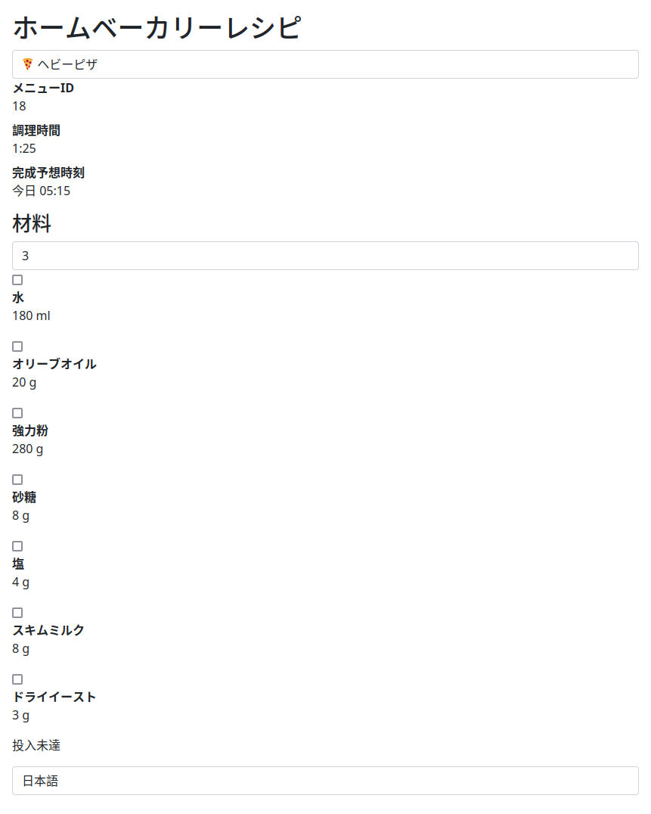

# siroca-bakery-recipe
This web app will enhance the use of your home bakery made by Siroca inc.  
Ingredients data is based on the product manual of SHB-712 and SHB-722.  
https://www.siroca.co.jp/product/bakery/  
  
I made this to learn vue.js and to keep my product manual from getting covered in bread flour.  
This repository is **NOT** affiliated with Siroca inc. 
  
**This is a work in progress.**  
  
## Screenshot

## Feature
* support multit langages (english/japanese)
* can be self-hosted

## License
* AGPL-3.0

## Test environment
* Firefox96 for macOS 11
* Safari for iOS 15

## Instllation
* `git clone https://github.com/Coro365/home-bakery-recipe-vue`
* `cd home-bakery-recipe-vue`
* `npm run serve`
* acsess to `localhost:8080` in your browser
